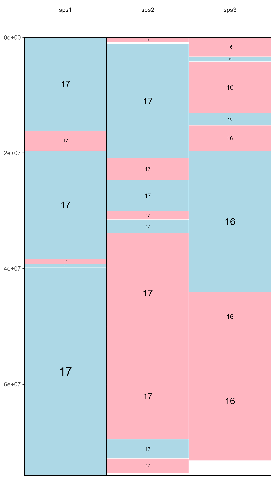

# syntenyPlotteR

R package to draw synteny plots in three different styles

This package has been developed by Joana Damas (<joanadamas@gmail.com>),
Sarah Quigley (<slq4@kent.ac.uk>), Denis Larkin (<dlarkin@rvc.ac.uk>)
and Marta Farré (<m.farre-belmonte@kent.ac.uk>)

It has been tested in Windows 10 R v4.0.3, Windows 11 with R v4.1.1 and
v4.2.2 and MAC OS Ventura 13.1

## To install:

### Using CRAN

``` r
install.packages("syntenyPlotteR")
library(syntenyPlotteR)
```

### Using github

``` r
install.packages("devtools")
library(devtools)
devtools::install_github("Farre-lab/syntenyPlotteR")
library(syntenyPlotteR)
```

------------------------------------------------------------------------

## Input files

### Input Alignment file

We provide a function to modify the output of DESCHRAMBLER or any other
synteny tool that creates this type of file:

**Alignment output file format for reformat.syntenyData function**


**Otherwise, you can provide your input Alignment file separated by
tabs**

DO NOT include a header line

- Reference chromosome ID
- Reference start position
- Reference end position
- Target chromosome
- Target start position
- Target end position
- Orientation
- Reference species ID
- Target species ID

**Example input alignment file format for the three functions**


### Chromosome Length file for draw.ideogram and draw.linear functions

Please provide a file containing all aligned species in order from
newest species – top of file – to ancestor – end of file, following this
format, separated by tabs

DO NOT include a header line

- Chromosome ID
- Chromosome length
- Species ID

**Example file format**

## 

------------------------------------------------------------------------

## Reformatting alignment data

The syntenyPlotteR package includes a function to reformat alignment
synteny data such as from DESCHRAMBLER or inferCARs - this does not
curate files only reformats it

The function outputs a text file containing the reformatted alignment
data As default the function saves the file to a temporary directory,
this can be overridden using the `directory` parameter
i.e. `directory = "path/to/directory"`.

### Usage

``` r
library(syntenyPlotteR)

reformat.syntenyData("file_data", "output.filename", reference.species = "reference.sps", target.species = "target.sps")
```

- file_data - alignment output file from DESCHRAMBLER/infeCARs
- output.filename - output file name for reformatted data in a character
  string

There are optional parameters for some customization of this function:

- reference.species - reference species ID as character string for final
  output table
- target.species - target species ID as character string for final
  output table
- directory - directory where to save text file
  i.e. `directory = "path/to/directory"`

### Example code using data files in *inst/extdata/*

``` r
reformat.syntenyData("example_map_1.map", "reformatted.data")
```

------------------------------------------------------------------------

## Evolution Highway style

### Usage

``` r
library(syntenyPlotteR)

draw.eh("output", chrRange, "data_file", fileformat = "png", colour = "lightblue", inverted.colour = "lightpink", w = 5.5, h = 10, ps = 10)
```

- output - String assigned to name of output file name
- chrRange - The range of chromosomes of the reference species this is
  entered as either a single number i.e. 1 or a range of numbers
  i.e. 1:22. *Note: if you are inputting sex chromosomes or chromosomes
  with characters in the name input a concatenated string
  i.e. c(1,2,3,“X”)*
- data_file - File containing the syntenic blocks of alignments of one
  or more target species aligned to a single reference

There are optional parameters for some customization of this function:

- fileformat - format for saving the image i.e. png or pdf, parameter
  use: `fileformat = "pdf"` (the default value is “png”)
- colour - colour of the syntenic blocks (not inverted blocks),
  parameter use: `colour = "red"` (the default value is “lightblue”, see
  Rcolour pallette for colour options)
- inverted.colour - colour of the inverted syntenic blocks, parameter
  use: `inverted.colour = "blue"` (the default value is “lightpink”, see
  Rcolour pallette for colour options)
- w - The width of the image created can be changed by using: `w = 5.5`
  (default)
- h - The height of the image created can be changed by using: `h = 10`
  (default)
- ps - The point size of the image created can be changed by using:
  `ps = 10` (default)
- directory - directory where to save image file
  i.e. `directory = "path/to/directory"` (default is save to temporary
  directory)

**Example code using data files in *inst/extdata/***

``` r
draw.eh("outputName", c(17,"X"), "example_eh_alignments_2.txt", fileformat = "pdf")
```

**Example output**

## 

------------------------------------------------------------------------

## Chromosome painting style

### Usage

``` r
library(syntenyPlotteR)  

draw.ideogram("file_data", "sizefile", "output", fileformat = "png", colours = colours.default, w=8.5, h=10, ps=5)
```

- file_data - file containing the syntenic blocks
- sizefile - tab separated file of all chromosome, scaffold, or contig
  lengths and the species identifier, in order from first target species
  in the alignment files followed by the first reference species in the
  alignment files – top of file – to the last target species and
  reference species in the alignment files – end of file.
- output - string assigned to the output file name

There are optional parameters for some customization of this function:

- fileformat - format for saving the image i.e. png or pdf, parameter
  use: `fileformat = "pdf"` (the default value is “png”)
- colours - colours to assign to the ideograms in a concatenated string
  of chromosome IDs with assigned colour values which can be found with
  R colour Pallette, paramter use:
  `colours = c("1" = "red", "2" = "blue", "3" = "green","4" = "orange", "5" = "purple","X" = "grey")`
  if no colours are assigned default values will be used but colours
  MUST be assigned to all chromosomes
- w - The width of the image created can be changed by using: `w = 5.5`
  (default)
- h - The height of the image created can be changed by using: `h = 10`
  (default)
- ps - The point size of the image created can be changed by using:
  `ps = 10` (default)
- directory - directory where to save image file
  i.e. `directory = "path/to/directory"` (default is save to temporary
  directory)

Target is the species which chromosomes will be painted. Reference will
be used for painting and diagonals. Chromosomes will be in the same
order as in the target sizes file.

**Example code using data files in *inst/extdata/***

``` r
draw.ideogram("example_alignment_1.txt", "example_lengths.txt", "example.ideogram")
```

**Example output**


------------------------------------------------------------------------

## Linear style

### Usage

``` r
library(syntenyPlotteR)

draw.linear(output, sizefile, ..., fileformat = "png", colours = colours.default, w=13, h=5, opacity = .5)
```

- output - string assigned to the output file name
- sizefile - tab separated file of all chromosome, scaffold, or contig
  lengths and the species identifier, in order from first target species
  in the alignment files followed by the first reference species in the
  alignment files – top of file – to the last target species and
  reference species in the alignment files – end of file.
- … - files containing the syntenic blocks (one file per alignment, in
  order from first target/reference (most recent species pairwise
  alignment in ancestral reconstruction data) alignment file to last
  target/reference (ancestor pairwise alignment in ancestral
  reconstruction data) alignment file)

Please ensure any species identifiers used between length and alignment
files are matching (same identifiers and letter case)

There are optional parameters for some customization of this function:

- fileformat - format for saving the image i.e. png or pdf, parameter
  use: `fileformat = "pdf"` (the default value is “png”)
- colours - colours to assign to the bands between ideograms in a
  concatenated string of chromosome IDs with assigned colour values
  which can be found with R colour Pallette, paramter use:
  `colours = c("1" = "red", "2" = "blue", "3" = "green","4" = "orange", "5" = "purple","X" = "grey")`
  if no colours are assigned default values will be used but colours
  MUST be assigned to all chromosomes
- w - The width of the image created can be changed by using: `w = 5.5`
  (default)
- h - The height of the image created can be changed by using: `h = 10`
  (default)
- opacity - the opacity of the ribbons can be changes using inputting:
  `opacity = .5` (default)
- directory - directory where to save image file
  i.e. `directory = "path/to/directory"` (default is save to temporary
  directory)

**Example code using data files in *inst/extdata/***

``` r
draw.linear("example_linear", "example_lengths.txt", "example_alignment_1.txt", "example_alignment_2.txt", "example_alignment_3.txt")
```

**Example output**


------------------------------------------------------------------------

### Citation:

While our publication is under review, please cite:  
Farré M, Kim J, et al. Evolution of gene regulation in ruminants differs
between evolutionary breakpoint regions and homologous synteny blocks.
Genome Research 2019 Apr;29(4):576-589
