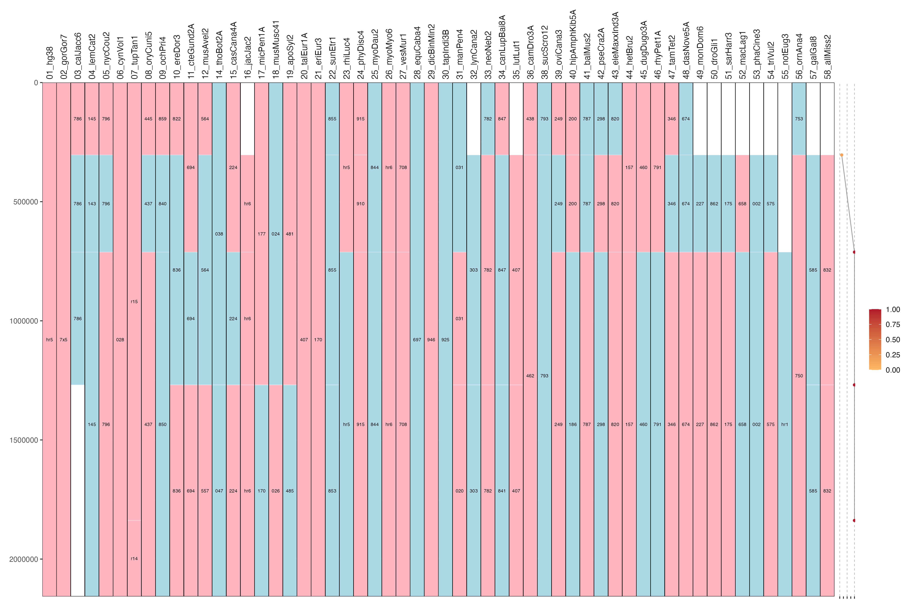

# Adjacency scores in syntenyPlotteR

This branch adds **experimental support for visualising DESCHRAMBLER adjacency scores** alongside Evolutionary History (EH) plots in `syntenyPlotteR`.

The workflow has **two steps**:

1. Convert DESCHRAMBLER output into an adjacency score table (`adjS`)
2. Plot EH blocks + adjacency scores using `draw.eh()`

## Example output

Below is an example of an EH plot with DESCHRAMBLER adjacency scores.
<p align="center">
  
</p>


---
## Installing from the experimental branch

By default, install_github() installs the main branch of syntenyPlotteR.
To install the adjacency-score functionality from the experimental branch, specify the branch name explicitly.

```
install.packages("devtools")
library(devtools)

devtools::install_github("Farre-lab/syntenyPlotteR", ref = "adjs_score")

library(syntenyPlotteR)
``` 

This installs the package directly from the adjs_score branch.

Notes

If you already have syntenyPlotteR installed, this will reinstall it from the specified branch

You can switch back to the main version at any time by running:

```
devtools::install_github("Farre-lab/syntenyPlotteR")
```

When to use which method?

| Method | Recommended for \
| ----- | ----- |
| `install_github(..., ref = "adjacency-scores")` | Most users / testers |
| `git clone + branch checkout` | Developers or people modifying code |

---

## 1. Converting DESCHRAMBLER output to `adjS`

### Purpose
DESCHRAMBLER reports adjacency scores between **syntenic fragment (SF) pairs**.  
To visualise these scores, they must be converted into **genomic positions along reconstructed ancestral chromosomes (APCFs)**.

The function `deschrambler_to_adjS()` performs this conversion.

---

### Required DESCHRAMBLER files

| File | Description |
|----|----|
| `Ancestor.APCF` | Reconstructed ancestral chromosome structure (order + orientation of SFs) |
| `Ancestor.ADJS` | Adjacency scores between SF pairs |
| `SFs/block_list.txt` | SF coordinates and IDs (used to compute SF lengths) |

---

### Function

```r
deschrambler_to_adjS(
  apcf_file,
  adjs_file,
  block_list_file,
  out_file = NULL,
  ancestor_name = NULL,
  include_ends = FALSE,
  chr_prefix = ""
)
```

---

### Key arguments

| Argument | Meaning |
|--------|--------|
| `apcf_file` | Path to `Ancestor.APCF` |
| `adjs_file` | Path to `Ancestor.ADJS` |
| `block_list_file` | Path to `block_list.txt` |
| `ancestor_name` | Name of the ancestor (overrides APCF header if provided) |
| `out_file` | Optional output file (tab-separated) |
| `include_ends` | Include 0–SF and SF–0 adjacencies (default `FALSE`) |
| `chr_prefix` | Optional prefix for chromosome IDs |

---

### Example

```r
adjS <- deschrambler_to_adjS(
  apcf_file       = "Ancestor.APCF",
  adjs_file       = "Ancestor.ADJS",
  block_list_file = "SFs/block_list.txt",
  ancestor_name   = "Bovid_ancestor_v3",
  out_file        = "Bovid_ancestor_v3.adjS.txt"
)
```

---

### Output format

The output table (written to file or returned) has **four columns**:

```
ancestor   chr   pos   score
```

- `ancestor`: ancestor name
- `chr`: APCF identifier (e.g. `1`, `2`, `APCF_3`)
- `pos`: genomic position (bp) along the APCF
- `score`: adjacency score (assumed to be in `[0,1]`)

This format is directly compatible with `draw.eh()`.

---

## 2. Plotting EH blocks + adjacency scores

### Purpose
`draw.eh()` now supports plotting adjacency scores in a **separate, narrow panel** next to the EH plot.

Features:
- Orange → red heatmap for adjacency score
- Grey line connecting scores
- Fixed score scale: **0–1**
- Reference lines at **0, 0.5, 1**

---

### Required input

| File | Description |
|----|----|
| EH alignment file | Standard `syntenyPlotteR` EH input |
| `adjS` file | Output of `deschramblER_to_adjS()` |

---

### Minimal example

```r
draw.eh(
  output    = "EH",
  chrRange  = c("1", "2"),
  data_file = "my_eh_alignments.txt",
  adj_file  = "Bovid_ancestor_v3.adjS.txt",
  directory = "plots"
)
```

This produces:
- One image per chromosome
- EH blocks faceted by target
- A narrow adjacency score panel on the right

---

## Optional tuning


The experimental adjacency-score version of `draw.eh()` exposes a small number of additional
arguments to control plot layout.

### Adjacency panel width

The width of the adjacency score panel is controlled as a **fraction of the total plot width**:

```r
draw.eh(
  output = "EH",
  chrRange = "1",
  data_file = "my_eh_alignments.txt",
  adj_file = "Bovid_ancestor_v3.adjS.txt",
  adj_panel_fract = 0.1, #this controls the width of the  Adj score panel
  directory = "plots"
)
```

### Labels inside EH blocks

By default, chromosome labels inside EH blocks are:

shortened to the last 3 characters

plotted at a constant font size (not scaled by block length)

These can be adjusted as follows:

```
draw.eh(
  ...,
  shorten_block_labels = TRUE,
  shorten_n = 3,
  label_fixed_size = 1.6
)
```

---

## Status

⚠️ These functions are **experimental** and intended for testing and feedback.  
APIs and defaults may change before full integration into `syntenyPlotteR`.

