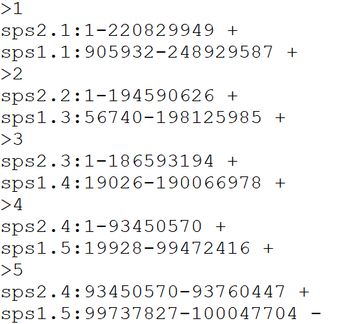
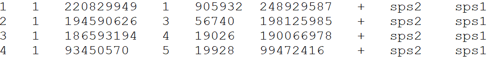
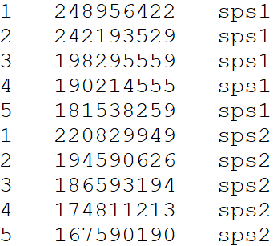

```{r, include = FALSE}
knitr::opts_chunk$set(
  collapse = TRUE,
  comment = "#>"
)
options(rmarkdown.html_vignette.check_title = FALSE)
```

## Introduction

Determining syntenic relationships between genomes is a important step in understanding genome evolution. To do this, researchers align species genomes to one another to detect sequence markers and conserved sequences to identify syntenic regions. There is a plethora of tools which can be used to identify this synteny such as DESCHRAMBLER. However, they often return tables showing the orientation and, start and stop positions of the syntenic regions which can often be hard to interpret at face value.

Here, we provide a tool which visualises this data, improving the interpretation of the alignment data, particularly for the identification, characterization, and visualization of chromosome rearrangements. SyntenyPlotteR relies on the use of ggplot2 to create the graphics, producing three potential visualizations: a linear relationship between syntenic regions of the genome using `draw.linear()`, an evolution highway style grid showing synteny between single chromosomes aligned between a single reference species and one or more target species using `draw.eh()`, and an ideogram with painted chromosomes to show syntenic relationships between two genomes using `draw.ideogram()`. There is also a function which can reformat data structured in the DESCHRAMBLER/inferCARs format to a structure suitable for the required input to the aforementioned functions using `reformat.syntenyData()`.

SyntenyPlotteR is solely designed to plot synteny data already gathered by the user. This tool does not generate syntenic relationships or curate data. As such, the user is required to construct syntenic blocks, therefore, allowing the user to choose the most appropriate tool for their needs. SyntenyPlotteR is easily implemented by the user with single line functions taking directly the tab delimited files containing the alignment data and chromosome lengths, thus meaning even inexperienced users find the process fast to learn and simple to use.

This package has been developed by Sarah Quigley ([slq4\@kent.ac.uk](mailto:slq4@kent.ac.uk){.email}), Joana Damas ([joanadamas\@gmail.com](mailto:joanadamas@gmail.com){.email}), Denis Larkin ([dlarkin\@rvc.ac.uk](mailto:dlarkin@rvc.ac.uk){.email}) and Marta Farré ([m.farre-belmonte\@kent.ac.uk](mailto:m.farre-belmonte@kent.ac.uk){.email})

## To install:

### Using CRAN

``` r
install.packages("syntenyPlotteR")
library(syntenyPlotteR)
```

------------------------------------------------------------------------

## Input files

### Alignment output file format for `reformat.syntenyData()` function

If chromosome alignment was performed using DESCHRAMBLER please input the .map file If chromosome alignment was performed using inferCARs please input the inferCARs output file

### Example file format

{width="380"}

### Alignment file input format for `draw.eh()`, `draw.ideogram()`, and `draw.linear()` functions

Please provide a file for the alignment synteny blocks following this format, separated by tabs

DO NOT include a header line

-   Reference chromosome ID
-   Reference start position
-   Reference end position
-   Target chromosome
-   Target start position
-   Target end position
-   Orientation
-   Reference species ID
-   Target species ID

### Example file format

{width="536"}

{width="525"}

### Chromosome Length file for `draw.ideogram()` and `draw.linear()` functions

Please provide a file containing all aligned species in order from first target species in the alignment files followed by the first reference species in the alignment files -- top of file -- to the last target species and reference species in the alignment files -- end of file, following this format, separated by tabs.

*Note: the order you input the species in the length file determines the order of which the species will be placed in the `draw.linear()` function; for example the first species in the length file (top of file) will be the first linear genome drawn thus at the bottom of the Y axis. In the case of aligning two target species to a single reference species, it is suggested you place the reference in the middle of the length file - i.e. target 1 (top of file), reference (middle of file), target 2 (bottom of file).*

DO NOT include a header line

-   Chromosome ID
-   Chromosome length
-   Species ID

### Example file format

{width="306"}

------------------------------------------------------------------------

## Reformatting alignment data

The syntenyPlotteR package includes a function to reformat alignment synteny data such as from DESCHRAMBLER or inferCARs - this does not curate files only reformats it

The function outputs a text file containing the reformatted alignment data. As default the function saves the file to a temporary directory, this can be overridden using the `directory` parameter i.e. `directory = "path/to/directory"`.

### **Usage**

``` r
library(syntenyPlotteR)

reformat.syntenyData("file_data", "output.filename", reference.species = "reference.sps", target.species = "target.sps")
```

-   file_data - alignment output file from DESCHRAMBLER/infeCARs
-   output.filename - output file name for reformatted data in a character string

There are optional parameters for some customization of this function:

-   reference.species - reference species ID as character string for final output table
-   target.species - target species ID as character string for final output table
-   directory - directory where to save text file i.e. `directory = "path/to/directory"`

### Example code using data files in *inst/extdata/*

``` r
reformat.syntenyData("example_map_1.map", "reformatted.data")
```

------------------------------------------------------------------------

## Evolution Highway style

The function outputs an image file containing the evolution highway style alignment. As default the function saves the file to a temporary directory, this can be overridden using the `directory` parameter i.e. `directory = "path/to/directory"`.

### Usage

``` r
library(syntenyPlotteR)

draw.eh("output", chrRange, "data_file", fileformat = "png", colour = "lightblue", inverted.colour = "lightpink", w = 5.5, h = 10, ps = 10)
```

-   output - String assigned to name of output file name
-   chrRange - The range of chromosomes of the reference species this is entered as either a single number i.e. 1 or a range of numbers i.e. 1:22. *Note: if you are inputting sex chromosomes or chromosomes with characters in the name input a concatenated string i.e. c(1,2,3,"X")*
-   data_file - File containing the syntenic blocks of alignments of one or more target species aligned to a single reference

There are optional parameters for some customization of this function:

-   fileformat - format for saving the image i.e. png or pdf, parameter use: `fileformat = "pdf"` (the default value is "png")
-   colour - colour of the syntenic blocks (not inverted blocks), parameter use: `colour = "red"` (the default value is "lightblue", see Rcolour pallette for colour options)
-   inverted.colour - colour of the inverted syntenic blocks, parameter use: `inverted.colour = "blue"` (the default value is "lightpink", see Rcolour pallette for colour options)
-   w - The width of the image created can be changed by using: `w = 5.5` (default)
-   h - The height of the image created can be changed by using: `h = 10` (default)
-   ps - The point size of the image created can be changed by using: `ps = 10` (default)
-   directory - directory where to save image file i.e. `directory = "path/to/directory"` (default is save to temporary directory)

### Example code using data files in *inst/extdata/*

``` r
draw.eh("outputName", c(17,"X"), "example_eh_alignments_2.txt", fileformat = "pdf")
```

### Example output:

{width="258"}

------------------------------------------------------------------------

## Chromosome painting style

The function outputs an image file containing the chromosome painting style alignment. As default the function saves the file to a temporary directory, this can be overridden using the `directory` parameter i.e. `directory = "path/to/directory"`.

### Usage

``` r
library(syntenyPlotteR)  

draw.ideogram("file_data", "sizefile", "output", fileformat = "png", colours = colours.default, w=8.5, h=10, ps=5)
```

-   file_data - file containing the syntenic blocks
-   sizefile - tab separated file of all chromosome, scaffold, or contig lengths and the species identifier, in order from first target species in the alignment files followed by the first reference species in the alignment files -- top of file -- to the last target species and reference species in the alignment files -- end of file.
-   output - string assigned to the output file name

There are optional parameters for some customization of this function:

-   fileformat - format for saving the image i.e. png or pdf, parameter use: `fileformat = "pdf"` (the default value is "png")
-   colours - colours to assign to the ideograms in a concatenated string of chromosome IDs with assigned colour values which can be found with R colour Pallette, paramter use: `colours = c("1" = "red", "2" = "blue", "3" = "green","4" = "orange", "5" = "purple","X" = "grey")` if no colours are assigned default values will be used but colours MUST be assigned to all chromosomes
-   w - The width of the image created can be changed by using: `w = 5.5` (default)
-   h - The height of the image created can be changed by using: `h = 10` (default)
-   ps - The point size of the image created can be changed by using: `ps = 10` (default)
-   directory - directory where to save image file i.e. `directory = "path/to/directory"` (default is save to temporary directory)

Target is the species which chromosomes will be painted. Reference will be used for painting and diagonals. Chromosomes will be in the same order as in the target sizes file.

*Note: If you have any alignments with chromosomes not defined in the length file the function will not run.*

### Example code using data files in *inst/extdata/*

``` r
draw.ideogram("example_alignment_1.txt", "example_lengths.txt", "example.ideogram")
```

### Example output:

![Figure 6 - Example ideogram showing a comparison between sps1 and sps2. In this figure sps1 is the target genome used to draw the chromosome ideograms, and sps2 is the reference genome. Where there is shared synteny between sps1 and sps2 the colours assigned to the sps2 chromosomes are used to colour the syntenic regions i.e. sps1 chromosome 1 is drawn using the black box and the green shading shows synteny with sps2 chromosome 1. Each syntenic block is traversed by a diagonal line, identification of multiple syntenic blocks is shown where there is a vertical line representing the end of one block and a start of another, with a diagonal line in each syntenic block, whereas completely syntenic chromosomes are depicted with a single line drawn from the bottom left to top right such as with chromosome 1. Inverted syntenic blocks are represented with a diagonal drawn from the top left to the bottom right as seen in the first syntenic block of chromosome 19 - sps1 chromosome 19 ideogram drawn and coloured showing synteny with sps2 chromosome 18.](images/example.ideogram.png){width="360"}

------------------------------------------------------------------------

## Linear style

The function outputs an image file containing the linear style alignment. As default the function saves the file to a temporary directory, this can be overridden using the `directory` parameter i.e. `directory = "path/to/directory"`.

### Usage

``` r
library(syntenyPlotteR)

draw.linear(output, sizefile, ..., fileformat = "png", colours = colours.default, w=13, h=5, opacity = .5)
```

-   output - string assigned to the output file name
-   sizefile - tab separated file of all chromosome, scaffold, or contig lengths and the species identifier, in order from first target species in the alignment files followed by the first reference species in the alignment files -- top of file -- to the last target species and reference species in the alignment files -- end of file.
-   ... - files containing the syntenic blocks (one file per alignment, in order from first target/reference (most recent species pairwise alignment in ancestral reconstruction data) alignment file to last target/reference (ancestor pairwise alignment in ancestral reconstruction data) alignment file)

Please ensure any species identifiers used between length and alignment files are matching (same identifiers and letter case)

There are optional parameters for some customization of this function:

-   fileformat - format for saving the image i.e. png or pdf, parameter use: `fileformat = "pdf"` (the default value is "png")
-   colours - colours to assign to the bands between ideograms in a concatenated string of chromosome IDs with assigned colour values which can be found with R colour Pallette, paramter use: `colours = c("1" = "red", "2" = "blue", "3" = "green","4" = "orange", "5" = "purple","X" = "grey")` if no colours are assigned default values will be used but colours MUST be assigned to all chromosomes
-   w - The width of the image created can be changed by using: `w = 5.5` (default)
-   h - The height of the image created can be changed by using: `h = 10` (default)
-   opacity - the opacity of the ribbons can be changes using inputting: `opacity = .5` (default)
-   directory - directory where to save image file i.e. `directory = "path/to/directory"` (default is save to temporary directory)

*Note: If you have any alignments with chromosomes not defined in the length file the function will not run.*

### Example code using data files in *inst/extdata/*

``` r
draw.linear("example_linear", "example_lengths.txt", "example_alignment_1.txt", "example_alignment_2.txt", "example_alignment_3.txt")
```

### Example output:

![Figure 7 - Example linear alignment plot between four species, from sps4 through to sps1. The grey boxes represent the chromosomes in each species genome, with the chromosome number written above the box. The coloured bands represent synteny between the genomes directly above/below one another. The colours of the bands represent the reference chromosome that shares synteny with the target chromosome i.e. chromosome 3 was assigned the colour pink thus any synteny originating from chromosome 3 in either sps2, sps3, or sps4 to the genome below will be shown by a pink band.](images/example_linear.png){width="530"}
